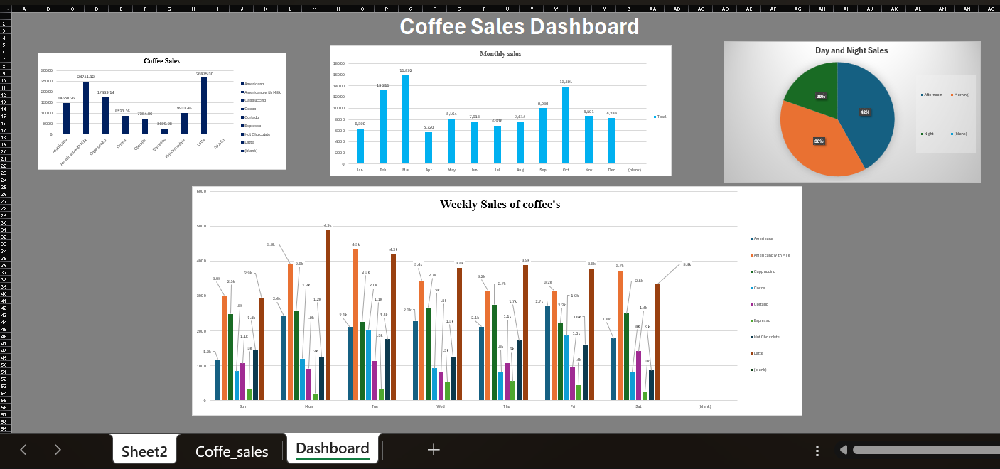

#  Coffee Shop Sales Analysis Dashboard (Excel)

##  Project Overview

This project analyzes coffee shop sales data using **Microsoft Excel**. The dataset was obtained from Kaggle and transformed into an interactive dashboard using Pivot Tables, Pivot Charts, and data visualization techniques.

The goal of this project is to identify sales trends, best-selling coffee products, monthly performance, and customer purchasing patterns throughout the week and different times of the day.

---

##  Objectives

- Analyze overall coffee sales performance.
- Identify top-selling coffee products.
- Compare monthly sales trends.
- Evaluate weekly sales distribution.
- Analyze sales by time of day (Morning, Afternoon, Night).
- Build an interactive dashboard for business insights.

---

##  Tools Used

- Microsoft Excel
- Pivot Tables
- Pivot Charts
- Data Cleaning
- Dashboard Design

---

##  Dataset

**Source:** Kaggle

The dataset contains coffee shop transaction records including:

- Product Type
- Sales Amount
- Date
- Day of Week
- Month
- Time of Day

---

#  Dashboard

## Final Dashboard



The dashboard provides a complete overview of:

- Product-wise Sales
- Monthly Sales Performance
- Weekly Sales Analysis
- Day vs Night Sales Distribution

---

#  Analysis & Visualizations

## 1. Product-wise Coffee Sales

.png)

### Key Insights

- **Latte** generated the highest revenue (**26,875.30**).
- **Americano with Milk** is the second best-selling product (**24,751.12**).
- **Espresso** recorded the lowest sales (**2,690.28**).

---

## 2. Monthly Sales Performance

.png)

### Key Insights

- **March** achieved the highest monthly sales (**15,891.64**).
- **October** was the second-best month (**13,891.16**).
- **April** recorded the lowest sales (**5,719.56**).

---

## 3. Day vs Night Sales Distribution

.png)

### Key Insights

- Afternoon sales contributed approximately **42%**.
- Morning sales contributed approximately **38%**.
- Night sales contributed approximately **20%**.

The majority of sales occur during Afternoon and Morning hours.

---

## 4. Weekly Sales Analysis

.png)

### Key Insights

- Sales remain relatively consistent throughout the week.
- Latte and Americano with Milk dominate weekly revenue.
- Monday and Tuesday show stronger performance for several products.

---

#  Pivot Table Analysis

## Product-wise and Monthly Sales Summary

.png)

### Product Revenue Ranking

| Product | Revenue |
|----------|----------:|
| Latte | 26,875.30 |
| Americano with Milk | 24,751.12 |
| Cappuccino | 17,439.14 |
| Americano | 14,650.26 |
| Hot Chocolate | 9,933.46 |
| Cocoa | 8,521.16 |
| Cortado | 7,384.86 |
| Espresso | 2,690.28 |

---

## Weekly Product Sales Pivot

.png)

This pivot table displays product performance across each day of the week, helping identify sales patterns and customer preferences.

---

## Time of Day Sales Pivot

.png)

This pivot table compares sales generated during:

- Morning
- Afternoon
- Night

and helps determine peak business hours.

---

#  Key Business Insights

- Latte is the most profitable product.

- March and October are the strongest sales months.

- Afternoon is the peak sales period.

- Espresso has the lowest revenue contribution.

- Weekly sales are stable, indicating consistent customer demand.

---

#  Future Improvements

- Add interactive slicers.
- Create dynamic KPI cards.
- Automate dashboard updates using Power Query.
- Build the same dashboard in Power BI for advanced analytics.

---

#  Project Structure

```text
Coffee-Sales-Project/
│
├── Coffe_sales.xlsx
├── README.md
│
└── images/
    ├── Final_Dashboard.png
    ├── Dashboard(1).png
    ├── Dashboard(2).png
    ├── Dashboard(3).png
    ├── Dashboard(4).png
    ├── Pivot-Tables(1).png
    ├── pivot_Table(2).png
    └── Pivot_Table(3).png
```

---

##  Author

**Giridhar Krishna**

Excel Dashboard Project | Data Analytics Portfolio

---

